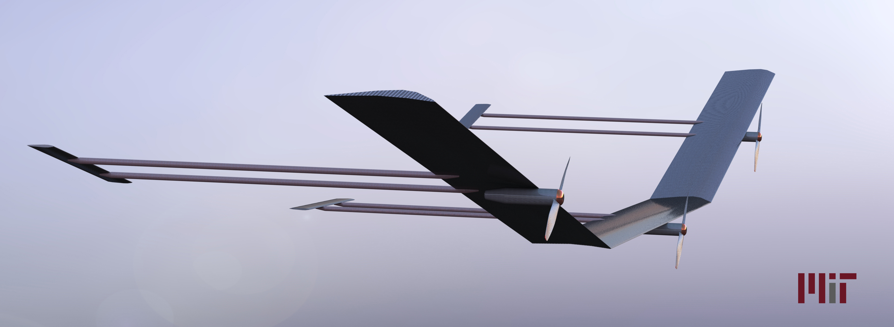

# vfa-model
Solidworks Model of Very Flexible Aircraft

Model created by Ben Thomsen based on mathematical description by Travis Gibson.

## Description
This repository holds the Solidworks (2016) files used to model a 3-panel VFA. It is designed following the mathematical descriptions and dimensions from the paper "*Modeling for Control of Very Flexible Aircraft*" (https://doi.org/10.2514/6.2011-6202).
